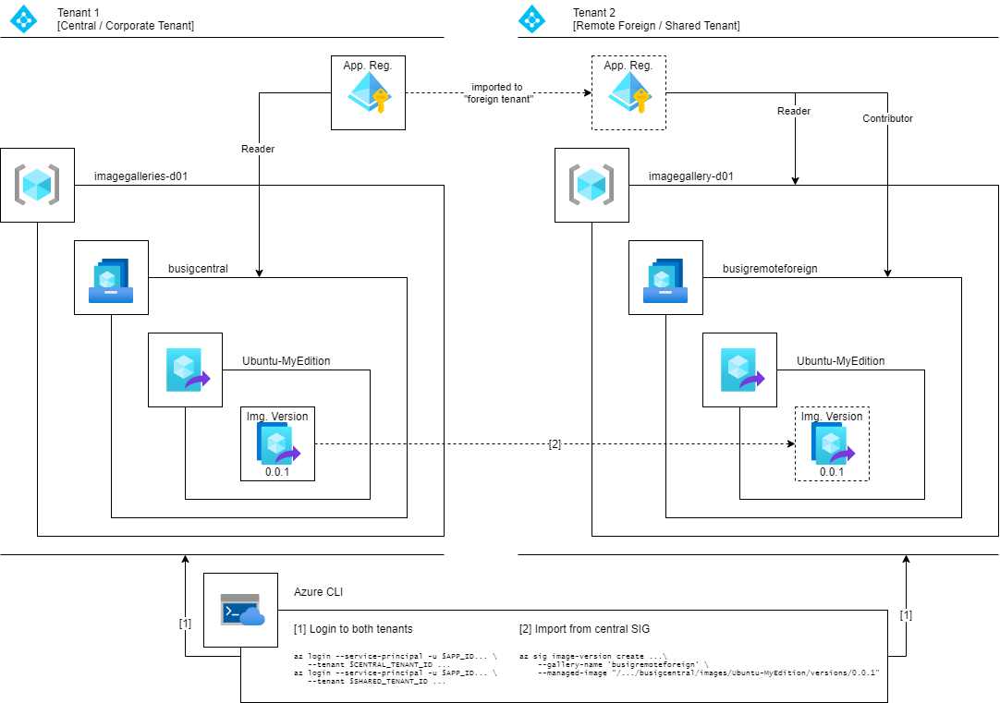
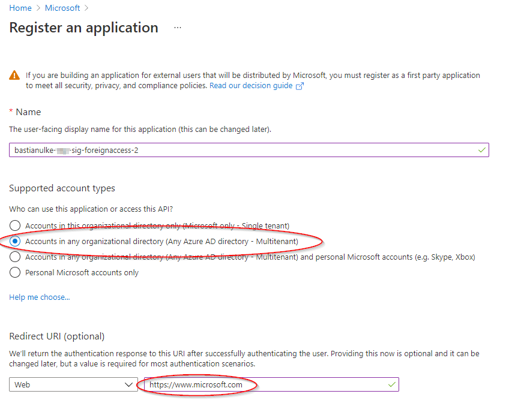
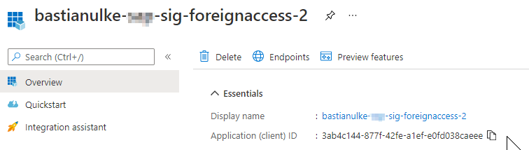
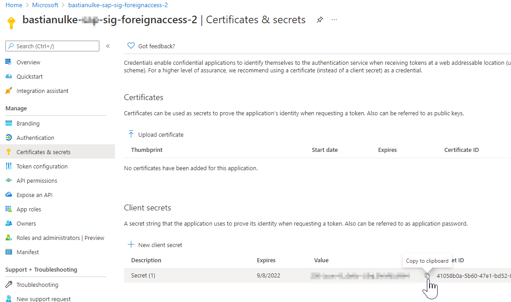
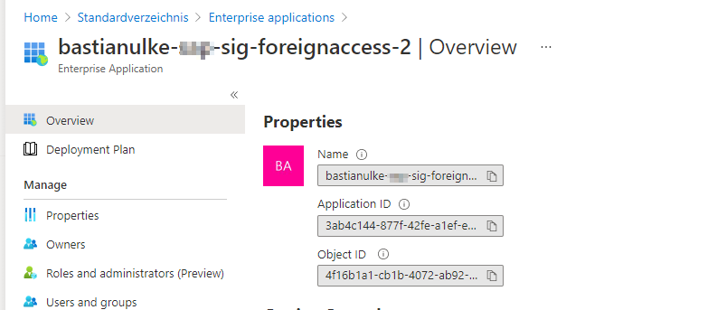

# Overview

The following procedure describes how to import a image version from a Shared Gallery in "Tenant 1" into a Shared Gallery deployed in the context of (another) "Tenant 2".


It is based on the guide [Share gallery VM images across Azure tenants using PowerShell](https://docs.microsoft.com/en-us/azure/virtual-machines/windows/share-images-across-tenants).

# (Preparation for demo setup) Create Managed Image as demo object

```
$ packer build ./image-demo.json
…

$ az image list
[
  {
    "name": "Ubuntu-MyEdition",
    ...    
]
```

# Define variables
``` 
export LOCATION=westeurope
export CENTRAL_TENANT_ID=aaaaaaaa-0000-0000-0000-000000000000
export CENTRAL_SUB_ID=bbbbbbbbb-0000-0000-0000-000000000000
export CENTRAL_RG_NAME=imagegalleries-d02
export CENTRAL_SIG_NAME=busigcentral2
export SHARED_TENANT_ID=cccccccc-0000-0000-0000-000000000000
export SHARED_SUB_ID=dddddddd-0000-0000-0000-000000000000
export SHARED_RG_NAME=imagegallery-d02
export SHARED_SIG_NAME=busigremoteforeign2
``` 

# Setup and Populate Shared Image Gallery in Tenant 1 ("Corporate Tenant")

## Create Resource Group
```
az group create \
    --subscription $CENTRAL_SUB_ID \
    --location $LOCATION \
    --name $CENTRAL_RG_NAME
```

## Create Shared Image Gallery
```
az sig create \
    --subscription $CENTRAL_SUB_ID \
    --resource-group $CENTRAL_RG_NAME \
    --gallery-name $CENTRAL_SIG_NAME
```

## Create Image Definition and import Image Version from Managed Image
```
az sig image-definition create \
    --subscription $CENTRAL_SUB_ID \
    --resource-group $CENTRAL_RG_NAME \
    --gallery-name $CENTRAL_SIG_NAME \
    --os-type "Linux" \
    --publisher "bastianulke-Corp" \
    --gallery-image-definition "Ubuntu-MyEdition" \
    --offer "0001-com-ubuntu-server-focal" \
    --sku "20_04-lts" 

MANAGED_IMAGE_ID=$(az image list --query "[?name=='Ubuntu-MyEdition'].id" -o tsv)

az sig image-version create \
    --resource-group $CENTRAL_RG_NAME \
    --gallery-name $CENTRAL_SIG_NAME \
    --gallery-image-definition "Ubuntu-MyEdition" \
    --gallery-image-version "0.0.1" \
    --managed-image $MANAGED_IMAGE_ID
```

# Create App Registration in Tenant 1, authorize and do a "Handshake" with Tenant 2
## Add App Registration in Tenant 1 ("Corporate Tenant") 


(Replace https://www.microsoft.com with another URI of your prference. But then make sure also to change the URL in the later step accordingly.)

## Get app id and set as variable

```
export APP_ID=<Paste App Registration id here.>
```
## Add a secret and set as variable

```
export APP_SECRET=<Paste App Registration secret value here.>
```


## Authorize App Registration to read from Shared Image Gallery
```
az role assignment create \
    --role "Reader" \
    --scope "/subscriptions/$CENTRAL_SUB_ID/resourceGroups/$CENTRAL_RG_NAME/providers/Microsoft.Compute/galleries/$CENTRAL_SIG_NAME" \
    --assignee "$APP_ID"
```

## Compose URL for authorization and call in Browser
(see guide [Share gallery VM images across Azure tenants using PowerShell](https://docs.microsoft.com/en-us/azure/virtual-machines/windows/share-images-across-tenants) for reference)

(Remember to adopt query parameter `redirect_uri` if you decided to replace https://www.microsoft.com with another URL of your preference above.)
```
echo "https://login.microsoftonline.com/$SHARED_TENANT_ID/oauth2/authorize?client_id=$APP_ID&response_type=code&redirect_uri=https%3A%2F%2Fwww.microsoft.com%2F"
``` 
Call URL in browser and log in with an account of Tenant 2 ("Shared Tenant"), adding the app to tenant 2.


## Look up app registration in Tenant 2 ("Shared Tenant")
Log in to tenant 2 in Azure Portal and browse to Enterprise Application (but not App Registrations!) and see if the application registration created above lists here with the same id:


# Setup Shared Image Gallery in Tenant 2 ("Shared Tenant")
## Login to Tenant 2 in CLI

```
az login
```

## Create Resource Group, Shared Image Gallery and Image Definition (just like we did in Tenant 1)
## Create Resource Group
```
az group create \
    --subscription $SHARED_SUB_ID \
    --location $LOCATION \
    --name $SHARED_RG_NAME

az sig create \
    --subscription $SHARED_SUB_ID \
    --resource-group $SHARED_RG_NAME \
    --gallery-name $SHARED_SIG_NAME

az sig image-definition create \
    --subscription $SHARED_SUB_ID \
    --resource-group $SHARED_RG_NAME \
    --gallery-name $SHARED_SIG_NAME \
    --os-type "Linux" \
    --publisher "bastianulke-Corp" \
    --gallery-image-definition "Ubuntu-MyEdition" \
    --offer "0001-com-ubuntu-server-focal" \
    --sku "20_04-lts" 
```

## Grant app registration Contributor rights on Shared Image Gallery and Reader rights on containing Resource Group
```
az role assignment create \
    --role "Contributor" \
    --scope "/subscriptions/$SHARED_SUB_ID/resourceGroups/$SHARED_RG_NAME/providers/Microsoft.Compute/galleries/$SHARED_SIG_NAME" \
    --assignee $APP_ID

az role assignment create \
    --role "Reader" \
    --scope "/subscriptions/$SHARED_SUB_ID/resourceGroups/$SHARED_RG_NAME" \
    --assignee $APP_ID
```

# Import image across tenant boundaries
## Clear Azure CLI logins and login as App registration to both tenant simultaneously
```
az account clear
az login --service-principal -u $APP_ID -p $APP_SECRET --tenant $CENTRAL_TENANT_ID
az login --service-principal -u $APP_ID -p $APP_SECRET --tenant $SHARED_TENANT_ID 
```

## Import image version from Tenant 1 ("Corporate Tenant")  to Tenant 2 ("Shared Tenant")
```
az sig image-version create \
    --subscription $SHARED_SUB_ID \
    --resource-group $SHARED_RG_NAME \
    --gallery-name $SHARED_SIG_NAME \
    --gallery-image-definition "Ubuntu-MyEdition" \
    --gallery-image-version "0.0.1" \
    --managed-image "/subscriptions/$CENTRAL_SUB_ID/resourceGroups/$CENTRAL_RG_NAME/providers/Microsoft.Compute/galleries/$CENTRAL_SIG_NAME/images/Ubuntu-MyEdition/versions/0.0.1"
```
